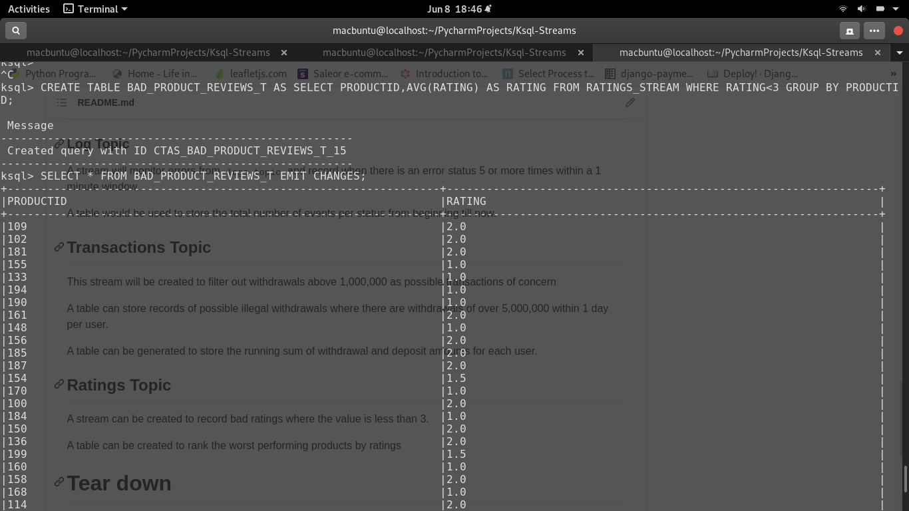
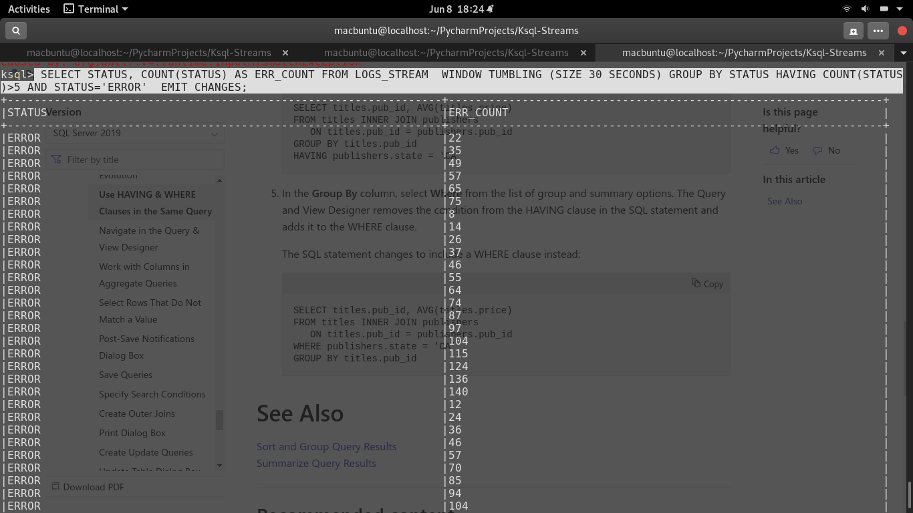
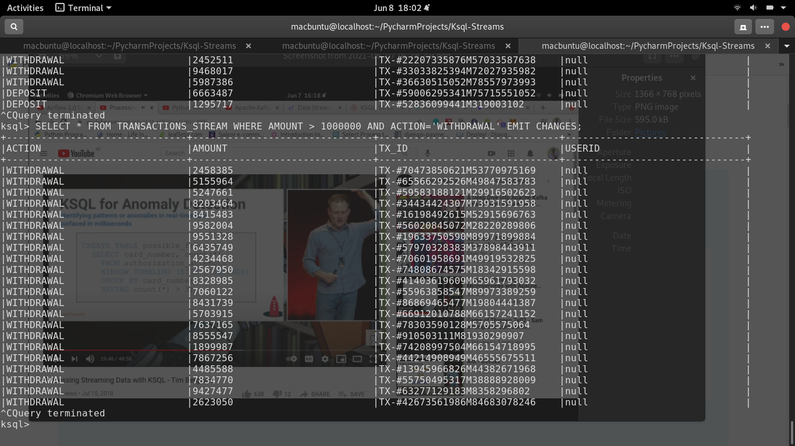

# Ksql-Streams
Learning stream processing using KSQL on top of Apache Kafka

I will be using this project to demonstrate real time analytics and also anomaly detection.
The use cases covered will be:

1. Anomaly detection- Use data generated from `mock_server_logs.py` in real time to perform anomaly detection. We will be checking for errors within a certain time frame. eg, if number of errors exceed 5 within 1 minute. This mimics the cloudwatch metrics in AWS.

2. Real time analytics for a product shop- Assume a high end online shop sells products and the business is very sensitive to bad ratings. The business would like to detect a bad rating as soon as it happens. This will then allow customer relations team to folow up. We will use KSQL to filter out bad ratings(less than 3 out of 5). We will use data from `mock_ratings.py`

3. Fraud detection using streaming analytics- Use bank transactional data generated by `mock_transactions.py` to provide a stream of transation actions. To detect possible fraud, we will filter out transactions with large withdrawal amounts.(greater than 1000000).

# Concepts
**Stream** Immutable sequence of events of data coming into a Kafka topic. Good for real time granular analysis

**Topic** A structure that represents the current state of data coming into a stream. 
Consider it as the sum total of all events in the stream at a certain point in time. Just like a normal SQL table. Good for aggregate and grouping analysis

# Producer
The producer for this demo is in `common_producer.py`. This will produce transactions logs and rating records for the KSQL Demo.

# Setup
The setup involves 2 `docker-compose` files. One that spins up the KAFKA clusters, ksqldb and ksql-CLI instances and one that spins the local project that contains the producer.
Create external network
```
docker network create kafka-network
```
Spin the Kafka cluster
``` 
docker-compose -f docker-compose.kafka.yaml up
```

Spin the app cluster that contains producer code

```
 docker-compose up
```

# Inspect different topics

## Transaction topic

```
docker-compose -f docker-compose.kafka.yml exec broker kafka-console-consumer --bootstrap-server localhost:9092 --topic transactions_topic
```

## Logs topic

```
docker-compose -f docker-compose.kafka.yml exec broker kafka-console-consumer --bootstrap-server localhost:9092 --topic logs_topic
```

## Ratings topic

```
docker-compose -f docker-compose.kafka.yml exec broker kafka-console-consumer --bootstrap-server localhost:9092 --topic ratings_topic
```

# KSQL Interactions

To connect to the KSQL CLI, you have to connect to the KSQL_CLI docker container. Find the container ID of the CLI container and run the command `docker exec -it <container-id> /bin/ksql http://ksqldb-server:8088
`
To list topics, `PRINT TOPICS;`
## Create Stream and Tables
### Log Topic
A stream will monitor errors from  `logs_topic` and record when there is an error status 5 or more times within a 30 second window.
```
 SELECT STATUS, COUNT(STATUS) AS ERR_COUNT FROM LOGS_STREAM  WINDOW TUMBLING (SIZE 30 SECONDS) GROUP BY STATUS HAVING COUNT(STATUS)>5 AND STATUS='ERROR'  EMIT CHANGES;
```


A table would be used to store the total number of events per status from beginning till now.
```
CREATE TABLE status_count_tab AS SELECT STATUS, COUNT(STATUS) AS ERR_COUNT FROM LOGS_STREAM GROUP BY STATUS EMIT CHANGES;
```

## Transactions Topic

This stream will be created to filter out withdrawals above 1,000,000 as possible transactions of concern
```
SELECT * FROM TRANSACTIONS_STREAM WHERE AMOUNT > 1000000 AND ACTION='WITHDRAWAL' EMIT CHANGES;
```

A table can store records of possible illegal withdrawals where there are withdrawals of over 5,000,000 within 1 day per user.
```
CREATE TABLE possible_illegal_Tnx AS SELECT USERID,ACTION, SUM(AMOUNT) AS TOTAL_WITDRAWAL FROM TRANSACTIONS_STREAM WINDOW TUMBLING (SIZE 24 HOURS ) GROUP BY USERID,ACTION HAVING SUM(AMOUNT)>5000000 AND ACTION='WITHDRAWAL';
```


A table can be generated to store the running sum of withdrawal and deposit amounts for each user.

```
CREATE TABLE activity_table AS SELECT ACTION, SUM(AMOUNT) AS TRANSACTED_AMOUNT FROM TRANSACTIONS_STREAM GROUP BY ACTION EMIT CHANGES;
```

## Ratings Topic

A stream can be created to record bad ratings where the value is less than 3.
```
SELECT * FROM RATINGS_STREAM WHERE RATING <3 EMIT CHANGES;
```


A table can be created to rank the worst performing products by ratings
```
CREATE TABLE BAD_PRODUCT_REVIEWS_T AS SELECT PRODUCTID,AVG(RATING) AS RATING FROM RATINGS_STREAM WHERE RATING<3 GROUP BY PRODUCTID;
```

# Tear down

To remove project network

`docker network rm kafka-network` 

To bring down kafka cluster `docker-compose -d docker-compose.kafka.yaml down`

To bring down project 

`docker-compose down` 

# Sample Screens

You can view the KSQL interactions as screenshots in the `screens` folder.
## Product Rating Table


## Error Stream


## Transaction Stream


# Further Reading- KSQL-Python API
You can interact with KSQL from a Python script using the `ksql-python` library that is built on top of the KSQL REST API resource. Below are sample interactions with the resource
```python
from ksql import KSQLAPI

client = KSQLAPI('http://ksqldb-server:8088')
# the param is the URL to your KSQL DB server. Locally or remote
# sample query
query = client.query("SELECT * FROM TRANSACTIONS_STREAM WHERE AMOUNT > 1000000 AND ACTION='WITHDRAWAL' ")
for row in query:
    print(row)
# create stream

client.create_stream(table_name='transactions_stream',
columns_type=['Tx_id bigint', 'Timestamp varchar', 'User varchar', 'Amount double', 'Action Varchar'],
topic='transactions_topic',
value_format='JSON')

# create stream with predicate conditions

client.create_stream_as(table_name='ratings_avro',
                     select_columns=['rating','productid','userid' ],
                     src_table='ratings_stream',
                     conditions='rating < 3',
                     kafka_topic='ratings_topic',
                     value_format='AVRO')
```